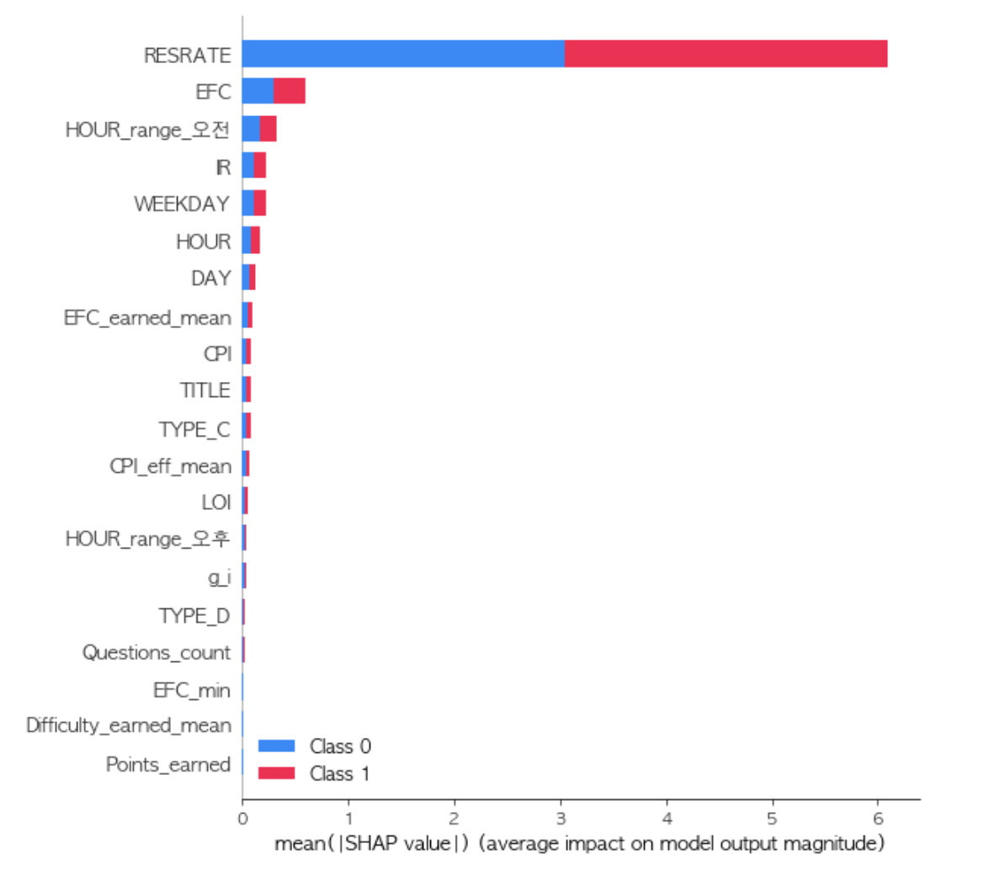
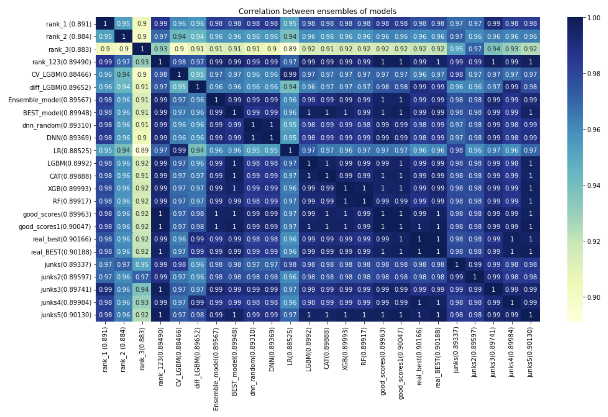
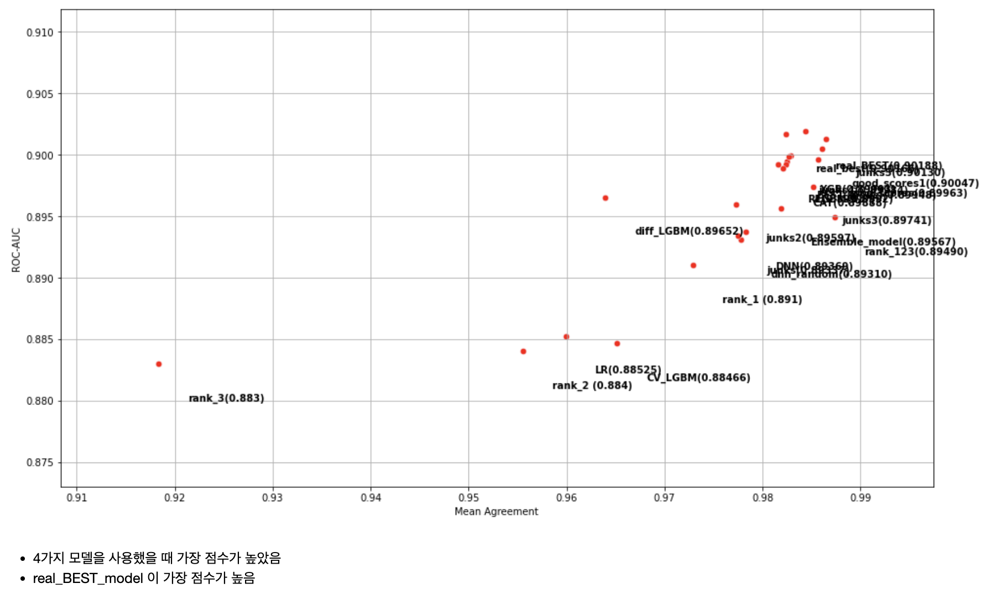

# Predicting survey responses

<h5 align="center"> Machine learning project  (2021-09 ~ 12) </h5>

This repository is a project I did in a machine learning class at school. In this repository you can find several python files, the final project is Predicting survey response. The project data is not publicly available as it is used in the field.

##### The project in this repository is divided into five main parts.

1. model hyperparameter tuning</li>
2. unbalanced data handling</li>
3. submission ensemble</li>
4. machine learning pipelines</li>
5. Predicting survey response</li>

This is a course I took in the second semester of my sophomore year, and I worked hard on it for another semester. Especially for the last 5 projects, it was a cagle competition, and I tried different ways to improve the performance.

<h2 align="center"> Visualization </h2>

 

##### Feature importance visualization through SHAP module.

##### Model predict correlation heatmap visualization.

##### After Model Ensemble, compare score of models.

<h2 align="center"> Project Description </h2>

<h4>Projects</h4>
<ul>In this section, we'll discuss five different projects. 

  <b>1. Model hyperparameter tunning</b> - Using two ongoing competitions on Kaggle, Predict Future Sales (link : https://www.kaggle.com/competitions/competitive-data-science-predict-future-sales) and Categorical Feature Encoding Challenge (link : https://www.kaggle.com/competitions/cat-in-the-dat), we performed ensembles on various submissions to improve our performance. 

  <b>2. Imbalanced Data Processing</b> - Using the WSDM - KKBox's Music Recommendation Challenge ( link : https://www.kaggle.com/competitions/kkbox-music-recommendation-challenge ) dataset released on Cagle, experiment with the Imbalanced Data Processing technique presented in the paper Survey of resampling techniques for improving classification performance in unbalanced datasets ( link : https://arxiv.org/abs/1608.06048 ).
  For the experiments, the dataset is constructed with class ratios of 10:90, 1:99, and 0.1:99.9, and then three situations are created.
  We use Accuracy, ROC-AUC, Recall, Precision, and F1-score as evaluation measures.
  Here we can see that the imbalanced Data Processing technique improves the accuracy for relatively small classes, even though the overall accuracy remains the same. We also see that in these cases, mbalanced Data Processing should be used when the discovery of relative silver classes is important.
  And I learned that imbalanced Data Processing techniques include Under_Sampling, Over_Sampling, Combine, and Ensemble. You can see the details in the pptx file. 

  <b>3. Submissions Ensemble</b> - Using two ongoing competitions on Kaggle, Predict Future Sales (link : https://www.kaggle.com/competitions/competitive-data-science-predict-future-sales) and Categorical Feature Encoding Challenge (link : https://www.kaggle.com/competitions/cat-in-the-dat), we performed ensembles on various submissions to improve our performance.
  We used arithmetic mean, weighted mean, geometric mean, and median mean for ensembling submissions, as well as several combinations.
  We checked the results by ensembling submissions with similar performance and submissions with low correlation. You can see the detailed experimental table in Submission Ensemble.pptx. 

  <b>4. Model pipeline</b> -Analyze the attributes of a department store customer's purchases over the course of a year to predict the customer's gender (0: female, 1: male).

Build an overall machine learning pipeline.
1. Read Data 
2. EDA (Identify Missing Values, Identify Data Attributes, Identify Similarities) 
3. Data processing (missing value handling, outlier handling, character variable encoding, feature selection) 
4. Model Hyperparameter Optimization
- Models used LogisticRegression, KNN, SupportVectorMachine, Extra tree, MLP 
5. Model Ensemble
- Tries all combinations and picks the best performing one.
- Finally, stack all the models above and select the best performing combination.
- Once again, we proceed with the submission ensemble. 

* Model Pipeline Strategy
The model pipeline strategy we envisioned is as follows: the traditional feature selection approach is to use the feature selection power-law results from a single model to lock in on a specific dataset, and then proceed with the rest of the pipeline. 
-> I realized that the important features might be different for each model, so I proceeded with the feature selection for each model presented above. If we do it for each model, the important features will be slightly different, and we will end up with as many different train datasets as there are models. Each model will have its own dataset and use it to make its own predictions. Since the datasets and models are different, the predictions are less correlated than before, and the performance of each is expected to improve because each has an optimal feature selection. Finally, we run the ensemble through all the combinations of the number of cases with their respective prediction results, and then stack the results by stacking the results that are less correlated with each other, and run the submission ensemble once again to generate the final submission. 

  <b>5. Predicting survey responses</b> -This is the final project, Survey Response Prediction. 
- Setup : Due to the limitation of computing resources, we first convert the type of data values in the dataset to reduce the memory capacity. Fix the seed to prevent the value from varying from run to run. 

- Before making predictions, we needed to think about a few things: this data is real-world data, and there are a lot of errors in the data because it was collected in the field. Therefore, we remove data that will not help us make predictions, for example, columns with more than 30% missing values. Also, this data has a time series nature, so using future information can cause the model to learn incorrectly, which can lead to overfitting.

1. Data processing: Remove outliers and missing values. Apply one-hot encoding for categorical and standard scaling for numerical. 
2. Create new features: Add features to improve the prediction results by adding ideas in various ways. 
3. feature selection 
4. divide the dataset: 6:4, 7:3 for experiments. 
5. create model
- Models used: DNN, LGBM, LogisticRegression, CatBoost, AdaBoost, XGB, RandomForest 
6. Model Ensemble, Bagging
- Ensemble the models and bag some of them. Due to the nature of this data, there was a lot of overfitting, and bagging compensated for this, resulting in a lot of performance improvement. 
7. Submission ensemble: We ensemble the finalized submissions in various combinations and expect to improve performance. 

</ul>

